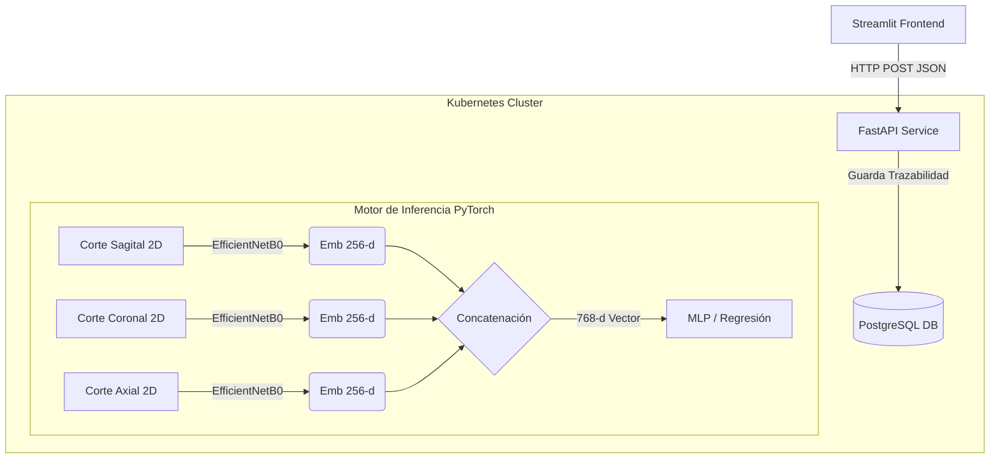

# 🧠 Clasificador de Riesgo de Autismo: Fusión Temprana de Embeddings Multivista


Este repositorio contiene la arquitectura completa (Microservicios + MLOps) de una aplicación para la predicción temprana de rasgos asociados al Espectro Autista. El modelo se apoya en un sistema de **Fusión Temprana de Embeddings** extraídos mediante `EfficientNetB0` a partir de vistas ortogonales separadas de Resonancias Magnéticas Cerebrales en 3D (MRI).

## 🌍 Demo en Vivo

Prueba la aplicación desplegada en Streamlit Cloud (versión lite sin Kubernetes):
- [https://app-prediccion-autismo-fusion-embeddings.streamlit.app/](https://app-prediccion-autismo-fusion-embeddings.streamlit.app/)

## 🛠️ Arquitectura de la Solución

El proyecto está diseñado bajo una arquitectura de microservicios desplegada en Kubernetes, lo que garantiza escalabilidad e independencia entre el frontend y el motor de predicción, apoyados por una base de datos persistente.



## ⚙️ Stack Tecnológico

- **Aplicación Frontend:** `Streamlit` para una interfaz de usuario interactiva y fluida con experiencia clínica.
- **Backend (API Rest):** `FastAPI` (servido por Uvicorn) para exponer los modelos a través de un endpoint ágil.
- **Machine Learning Core:** `PyTorch` y `TorchVision` para el procesamiento tensorial y la inferencia a alta velocidad de la red multimodal.
- **Persistencia de Datos:** `PostgreSQL` y `SQLAlchemy` para guardar un registro histórico e integrado de cada inferencia.
- **Infraestructura DevOps:** Contenerización con `Docker` y orquestación integral en entorno de desarrollo local mediante `Minikube (Kubernetes)`.

## 🗂️ Estructura del Proyecto

```text
app_prediccion_autismo_multimodal/
├── api/                        # Backend FastAPI
│   ├── main.py                 # Endpoints (incluye lógica de persistencia a BD)
│   ├── model.py                # Clase MultimodalPredictor e inferencia PyTorch
│   ├── database.py             # Conexión SQLAlchemy a PostgreSQL
│   ├── models_db.py            # Esquema de tablas ORM (predictions)
│   └── Dockerfile              # Empaquetado del microservicio API
├── app/                        # Frontend Web (UI)
│   ├── app.py                  # Interfaz principal de Streamlit
│   └── assets/                 # Casos pre-cargados para testeo rápido
├── k8s/                        # Manifiestos IAC (Kubernetes)
│   ├── api-deployment.yaml     # Despliegue de réplicas de la API (NodePort)
│   ├── api-service.yaml        # Exposición interna del servicio
│   ├── postgres-pvc.yaml       # Reclamación de almacenamiento persistente
│   └── postgres-*.yaml         # Base de datos deployment y servicio interno
├── models/                     # Carpeta de los pesos de la red entrenados `.pth`
├── notebooks/                  # Cuadernos de experimentación
│   ├── EDA.ipynb
│   ├── PREPROCESAMIENTO.ipynb
│   ├── ENTRENAMIENTO_MODELOS_POR_CORTE.ipynb
│   └── ENTRENAMIENTO_MODELO_MULTIMODAL.ipynb
├── requirements-api.txt        # Dependencias de Backend
└── requirements-app.txt        # Dependencias de Frontend
```

## 🚀 Guía de Despliegue Estructura Kubernetes (Local)

Para iniciar la arquitectura de microservicios en tu equipo, debes tener configurado **Docker Desktop** y **Minikube**. Todo el flujo corre sobre la red interna del clúster de k8s.

### 1. Iniciar Minikube
Abre un terminal y lanza el clúster con suficientes recursos:
```powershell
minikube start --memory=4096 --cpus=2

# Conectar la terminal actual al daemon Docker interno de Minikube (Windows)
minikube docker-env | Invoke-Expression
```

### 2. Base de Datos
Aplicamos los manifiestos YAML para instanciar la base de datos persistente:
```powershell
kubectl apply -f k8s/postgres-pvc.yaml
kubectl apply -f k8s/postgres-deployment.yaml
kubectl apply -f k8s/postgres-service.yaml
```

### 3. Backend (FastAPI)
Construir y exponer la API:
```powershell
# Compilar la imagen dentro del entorno de Minikube
docker build -t medical-api:v1 -f api/Dockerfile .

# Desplegar la API en el Cluster
kubectl apply -f k8s/api-deployment.yaml
kubectl apply -f k8s/api-service.yaml
```

Verifica validando los pods con `kubectl get pods`.

### 4. Lanzar la Interfaz Web
Minikube expone la IP y el Puerto con este comando auxiliar:
```powershell
# Genera el enlace y el túnel; NO CIERRES esta ventana.
minikube service medical-api-service --url
```

Copia la `URL` obtenida (por ejemplo, `http://127.0.0.1:56269`), abre **otra sesión de terminal**, y lanza el frontend:
```powershell
# Configuración del virtual environment (Opcional pero recomendado)
python -m venv .venv
.venv\Scripts\activate
pip install -r requirements-app.txt

# Exportamos la variable que necesita el código Streamlit
$env:API_URL="http://127.0.0.1:56269"

streamlit run app/app.py
```
> Listo, accederás a la aplicación completa y toda inferencia quedará guardada de modo trazable en PostgreSQL.

---

### 🛑 Comandos Útiles

- **Dashboard Gráfico:** Analizar consumos mediante `minikube dashboard`.
- **Acceso a la BD:** `kubectl exec -it <nombre-pod-postgresql> -- psql -U user -d medical_db` y luego realiza tu `SELECT * FROM predictions;`.
- **Apagar Infraestructura:** Preserva datos mediante estado persistente local: `minikube stop`.

## 📊 Resultados de Referencia y Datos

Evaluación reportada en conjunto held-out:
- **AUROC**: `0.6738`
- **F1-score ponderado**: `0.64`

El pipeline asume estructura por sujeto (ejemplo: `subject_id/axial.png`, `subject_id/sagittal.png`, `subject_id/coronal.png`).
- Dataset de referencia: [HuggingFace - ASD_3D_Images_Single](https://huggingface.co/datasets/Bhagya11/ASD_3D_Images_Single).

*Nota médica: El sistema está orientado a tamizaje y apoyo investigativo. No sustituye protocolos clínicos de diagnóstico psiquiátrico ni la observación del comportamiento humano (ej. ADOS-2 o ADI-R).*

## 📄 Licencia
Este proyecto se distribuye bajo [Licencia MIT](LICENSE) como prueba de concepto para la interconexión de orquestadores con modelos clínicos.
