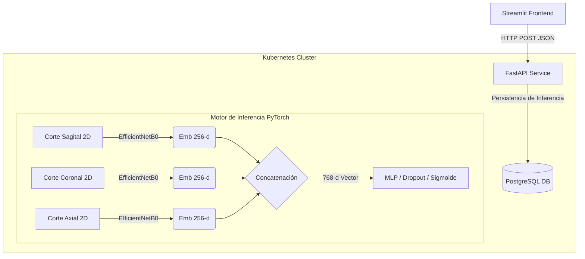

# 🧠 Modelo Exploratorio de Fusión Multimodal para Clasificación de Riesgo Asociado al TEA


> [!WARNING]
> **Aviso Médico Importante:** Este proyecto es una **Proof of Concept (Prueba de Concepto)** orientada exclusivamente a la investigación y exploración tecnológica en arquitecturas de deep learning. **No es una herramienta de diagnóstico clínico**, su rendimiento actual no está validado para su uso en pacientes, y no debe sustituir la evaluación psiquiátrica ni el juicio clínico profesional (ej. pruebas estandarizadas como ADOS-2 o ADI-R).

Este repositorio presenta un **pipeline de inferencia desacoplado y containerizado** que explora la clasificación de variables anatómicas asociadas al Trastorno del Espectro Autista (TEA) utilizando Resonancias Magnéticas Cerebrales (MRI). El modelo utiliza **fusión temprana de embeddings multivista** (Cortes Sagital, Coronal y Axial).

## 🌍 Demo en Vivo

Prueba la interfaz del sistema predictivo desplegada de forma estática en Streamlit Cloud (sin clúster Kubernetes nativo):
- [https://app-prediccion-autismo-fusion-embeddings.streamlit.app/](https://app-prediccion-autismo-fusion-embeddings.streamlit.app/)

## 🛠️ Arquitectura Desacoplada

La solución está implementada bajo una **arquitectura desplegada en contenedores sobre Kubernetes**, garantizando separación de responsabilidades entre el frontend de usuario, el servicio de inferencia y la base de datos de auditoría clínica.



## 🔬 Metodología y Configuración Experimental

El proyecto trabaja integrando información tridimensional proyectada en tres vistas bidimensionales para potenciar la regularización geométrica de los cortes.

### Conjunto de Datos y Preprocesamiento
- **Fuente Base:** El proyecto parte del dataset [HuggingFace - ASD_3D_Images_Single](https://huggingface.co/datasets/Bhagya11/ASD_3D_Images_Single), compuesto de resonancias en formato `.nii` procesadas previamente (skull-stripping/masking estilo ABIDE).
- **Procesamiento de los Cortes:** Para reducir la complejidad computacional masiva de las redes CNN-#D, extrajimos el *corte medio (middle slice)* de cada proyección (Sagital, Coronal y Axial).
- **Control de Fugas (Leakage):** La división del conjunto (entrenamiento, validación, evaluación) se realizó a **nivel de sujeto (Paciente)**, garantizando que los tres cortes anatómicos del mismo sujeto estén siempre en el mismo split, evitando la contaminación cruzada o validación engañosa.
- **Balanceo:** Los splits conservan la estratificación para equilibrar la clase neurotípica (Control) contra la etiqueta TEA.

### Modelado
- **Backbone CNN:** Elegimos `EfficientNetB0` por su balance excepcional entre eficiencia paramétrica (~5.3M de peso) y robustez en la extracción espacial. 
- Al extraer la capa softmax de cada CNN y truncarla a 256 dimensiones, inyectamos luego a un MLP una matriz total de 768 dimensiones unificada.

## 📊 Métricas y Evaluación

Evaluación formal sobre el grupo **held-out de validación estricta**:

| Métrica | Resultado |
|---------|-----------|
| **AUROC** | `0.6738` |
| **F1-Score (Macro / Ponderado)** | `0.6402` |
| **Accuracy** | `0.6550` |
| **Recall / Sensibilidad** | `0.6300` |

> *El nivel predictivo actual subraya la complejidad intrínseca de predecir endofenotipos a partir de cortes de MRI puros sin sumar covariables biográficas (edad, género o coeficiente).*

## ⚠️ Limitaciones del Estudio

La transparencia en sistemas ML de salud es vital. Entre las limitaciones identificadas están:
1. **Pérdida de Resolución Espacial 3D:** Al utilizar planos medios 2D se descartó volumetría cerebral valiosa en aras del ahorro computacional.
2. **Relevancia Clínica:** AUROC de `0.67` no es válido para screening clínico ni tamizaje poblacional real.
3. **Calidad de Sesgos:** Sujeto a variaciones técnicas de los escáneres iniciales (T1W, contraste intra-sitio de la plataforma ABIDE).
4. **Falta de Validación Externa:** El sistema no ha sido testeado en datasets generados en centros médicos ajenos a los usados en HuggingFace, corriendo el riesgo de sobreajuste de sitio (site-specific bias).

## 🗂️ Estructura del Repositorio

```text
app_prediccion_autismo_multimodal/
├── api/                        # Backend Model Serving
│   ├── main.py                 # FastAPI Endpoint y DB Hooks
│   ├── model.py                # Fusión y Pesos (PyTorch)
│   ├── models_db.py            # Tablas SQLAlchemy (Auditoría)
│   ├── database.py             # Driver Conexión
│   └── Dockerfile              
├── app/                        # Streamlit Frontend UI
│   ├── app.py                  
│   └── assets/                 # Pacientes de Prueba Dummy
├── k8s/                        # Infraestructura como Código
│   ├── api-*.yaml              # Deployments/Servicios del Endpoint
│   └── postgres-*.yaml         # RDBMS Persistente
├── models/                     # Checkpoints de la Red (.pth)
├── notebooks/                  # Notebooks Source (Investigación)
│   ├── EDA.ipynb               # Control de Calidad y Metadatos
│   ├── PREPROCESAMIENTO.ipynb  # Limpieza y Anti-Leakage
│   └── ENTRENAMIENTO*.ipynb    # Tuning y Fusión
├── .env.example                # Plantilla de variables
├── README.md                   
├── requirements-api.txt        
└── requirements-app.txt        
```

## 🚀 Instalación y Despliegue Local

Necesitas **Docker Desktop** y **Minikube** configurados en tu SO.

### 1. Iniciar Cluster y Persistencia
```powershell
minikube start --memory=4096 --cpus=2
minikube docker-env | Invoke-Expression

# Instanciar el almacenamiento
kubectl apply -f k8s/postgres-pvc.yaml
kubectl apply -f k8s/postgres-deployment.yaml
kubectl apply -f k8s/postgres-service.yaml
```

### 2. Despliegue de la API FastAPI
```powershell
# Construcción delegada en el daemon del Minikube
docker build -t medical-api:v1 -f api/Dockerfile .
kubectl apply -f k8s/api-deployment.yaml
kubectl apply -f k8s/api-service.yaml

# Abrir el túnel HTTP hacia FastAPI (Dejar corriendo)
minikube service medical-api-service --url
```

### 3. Frontend y Ejemplo de Integración
Copia la variable del comando anterior dentro del fichero `.env` para enlazar la UI web:
```powershell
# Usando entorno virtual
python -m venv .venv
.venv\Scripts\activate
pip install -r requirements-app.txt

$env:API_URL="http://127.0.0.1:<PORT>"
streamlit run app/app.py
```

### 💡 Ejemplo de Request vía cURL a la API
Si se desea consumir de una plataforma que no sea Streamlit:
```bash
curl -X POST "http://127.0.0.1:<PORT>/predict" \
  -H "accept: application/json" \
  -H "Content-Type: multipart/form-data" \
  -F "sagittal_file=@./data/test/mri_sagittal.jpg" \
  -F "coronal_file=@./data/test/mri_coronal.jpg" \
  -F "axial_file=@./data/test/mri_axial.jpg"
```
```json
{
  "status": "success",
  "probability": 0.825,
  "predicted_class": 1,
  "message": "Recorded to DB with ID 4"
}
```

## 🔮 Trabajo Futuro (Future Work)
- **Fusión Multimodal Bio-Demográfica:** Añadir ramas ML numéricas para incluir variables demográficas de los pacientes junto a las mallas convolucionales.
- **Explainable AI (XAI):** Mapeo con Grad-CAM en la API para devolver un **Heatmap** de qué región anatómica empujó la decisión al TEA frente a la interfaz web.
- **Técnicas 3D:** Pivotar del arreglo 2D multivista hacia verdaderas redes 3D-CNN ligeras para retener volúmenes estructurales.

## 📄 Licencia
Este proyecto se rige por la [Licencia MIT](LICENSE) como infraestructura base de código abierto.
