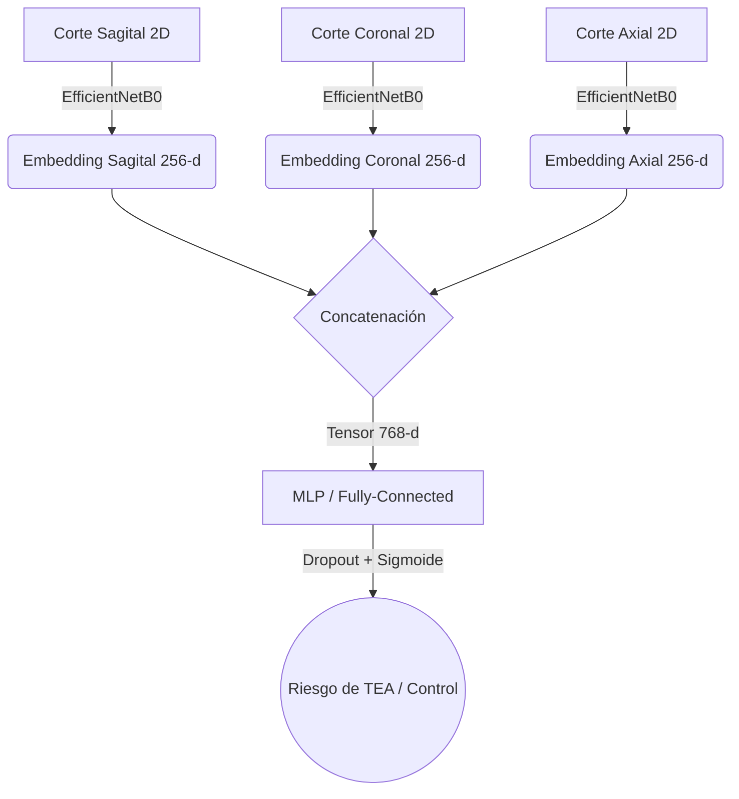

# 🧠 Clasificador de Riesgo de Autismo: Fusión Temprana de Embeddings Multivista


Este repositorio contiene el código fuente de una aplicación de **Streamlit** y una estructura completa **MLOps** que permite la predicción temprana de rasgos asociados al Espectro Autista. El modelo se apoya en un sistema de **Fusión Temprana de Embeddings** extraídos mediante `EfficientNetB0` a partir de vistas ortogonales separadas de Resonancias Magnéticas Cerebrales en 3D (MRI).

## ✨ Características Principales

* **Fusión de Representaciones Latentes:** El núcleo del sistema extrae características tridimensionales simuladas al evaluar un MRI preprocesado en sus cortes **Axial, Coronal y Sagital** a través de backbones de *Convolutional Neural Networks* (ResNet-like / EfficientNet).
* **Perceptrón Multicapa (MLP):** Los 3 vectores de alta densidad (256-D cada uno) se concatenan en un **hipervector de 768-D** que es introducido a una red densa responsable de detectar alteraciones estructurales inter-cortes.
* **Interfaz Profesional en Streamlit:** UI limpia diseñada para propósitos demostrativos que ofrece explicabilidad básica y predicción de riesgo binario.
* **Módulos Independientes:** Incluye cuadernos completos de *Exploratory Data Analysis* (EDA), Preprocesamiento sin fugas (Anti-Leakage por paciente), Entrenamientos individuales y Fusión final.

---

## 🛠️ Arquitectura de la Solución



## 🗂️ Estructura del Proyecto

```text
app_prediccion_autismo_fusion_embeddings/
├── app.py                      # Aplicación Streamlit principal y UI
├── requirements.txt            # Dependencias del entorno
├── README.md                   # Esta documentación
├── src/                        # Código base y scripts de Inferencia
│   └── inference.py            # Clase MultimodalPredictor para hacer inferencia en vivo
├── models/                     # Carpeta local de almacenamiento de pesos entrenados
│   └── baseline/               # Modelos base `.pth` de extracción
├── notebooks/                  # Experimentos técnicos MLOps 
│   ├── EDA.ipynb                               # Análisis estadístico del MRI Dataset
│   ├── PREPROCESAMIENTO.ipynb                  # Balance, Augmentación y Splits
│   ├── ENTRENAMIENTO_MODELOS_POR_CORTE.ipynb   # Tuning aislado de EfficientNetB0
│   └── ENTRENAMIENTO_MODELO_MULTIMODAL.ipynb   # Fusión temprana y ensamble de predictores
└── examples/                   # Casos pre-cargados a nivel de demostración UI
```

## 🚀 Instalación y Ejecución Local

Si deseas correr este proyecto de forma local para investigar la red o modificar los parámetros gráficos de inferencia:

### 1. Clonar el repositorio
```bash
git clone https://github.com/ErnestoSCL/app_prediccion_autismo_fusion_embeddings.git
cd app_prediccion_autismo_fusion_embeddings
```

### 2. Instalar las dependencias
Asegúrate de contar con Python 3.9 o superior. Se recomienda altamente trabajar dentro de un `venv`:
```bash
python -m venv venv
source venv/bin/activate  # En Windows: venv\Scripts\activate
pip install -r requirements.txt
```

### 3. Levantar la Interfaz Web con Streamlit
```bash
streamlit run app.py
```
> El servicio se montará por defecto en `http://localhost:8501`.

---

## 📊 Métricas de Rendimiento (Evaluación en Held-Out puro)

El sistema general promedia el siguiente desempeño clínico sobre la población invisible de validación (`Test Split`):
- **AUROC (Área Bajo la Curva ROC)**: `0.6738`
- **F1-Score Ponderado**: `0.64`
- _Nota Médica:_ Este modelo está diseñado para **screening temprano de marcadores anatómicos asociados**, no reemplaza métodos estandarizados de diagnóstico psiquiátrico y observación del comportamiento (como ADOS-2 o ADI-R).

## 📄 Licencia y Agradecimientos

- Todos los scripts de *Machine Learning* están distribuidos bajo Licencia MIT.
- **Datos de Resonancia:** Los recortes y pre-procesamientos de *masking* de cerebro utilizaron el pipeline de `FreeSurfer` en bases de datos abiertas del ecosistema ABIDE. 

Desarrollado como proyecto avanzado de Deep Learning para arquitecturas de Visión Combinadas y Fusión Temprana.
