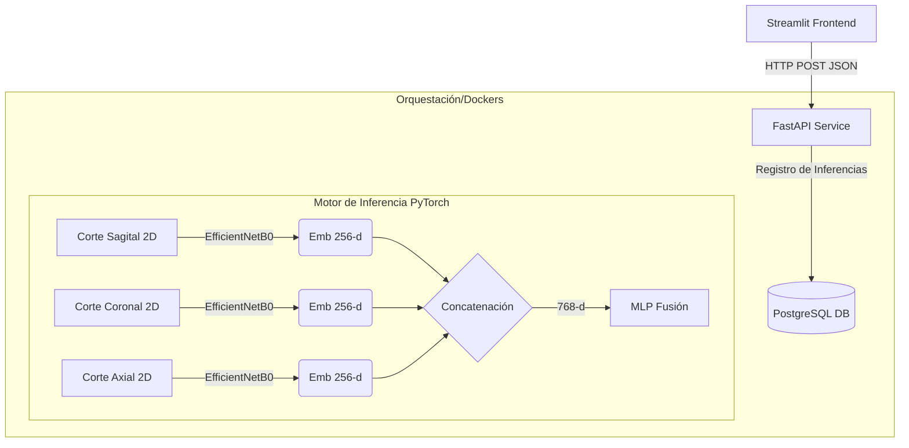

# 🧠 Modelo Exploratorio de Fusión Multimodal para Clasificación de Riesgo Asociado al TEA


> [!WARNING]
> **Aviso Médico Importante:** Este proyecto es una **Proof of Concept (Prueba de Concepto)** orientada exclusivamente a la investigación y exploración tecnológica en arquitecturas de deep learning. **No es una herramienta de diagnóstico clínico**, su rendimiento actual no está validado para su uso en pacientes, y no debe sustituir la evaluación clínica profesional.

## 📌 Resumen Ejecutivo

Este proyecto propone un modelo exploratorio basado en fusión multimodal de imágenes MRI para predecir características relacionadas al Trastorno del Espectro Autista (TEA). Se implementa un pipeline completo que abarca desde el preprocesamiento hasta la inferencia desplegada mediante una arquitectura desacoplada.

El objetivo principal es evaluar la viabilidad técnica de modelos multivista bajo restricciones computacionales, y demostrar habilidades de ingeniería MLOps, no desarrollar una herramienta clínica productiva.

---

## 🔬 1. Investigación y Desarrollo ML

### 📊 Conjunto de Datos y Preprocesamiento
- **Fuente Base:** Dataset [HuggingFace - ASD_3D_Images_Single](https://huggingface.co/datasets/Bhagya11/ASD_3D_Images_Single), compuesto de resonancias en formato `.nii` preprocesadas mediante *skull-stripping*.
- **Control de Fugas (Leakage):** La división del conjunto se realizó a **nivel de sujeto (Paciente)**, garantizando que los tres cortes anatómicos del mismo sujeto estén siempre en el mismo split.
- **Balanceo:** Los splits conservan la estratificación para equilibrar la clase neurotípica (Control) contra la etiqueta TEA.

### 🧩 Justificación del Enfoque y Metodología
- **Aproximación 2D Multivista:** Uso de cortes ortogonales (el corte medio Sagital, Coronal y Axial) como una aproximación ligera al volumen 3D masivo, reduciendo la extrema carga computacional paramétrica de las redes 3D-CNN.
- **Backbone CNN:** Selección de `EfficientNetB0` por su excepcional eficiencia paramétrica para extraer bolsas de características iniciales.
- **Fusión Temprana:** Se concatenan tempranamente los vectores antes de la decisión superior, para capturar correlaciones volumétricas inter-plano cruzadas.

### 📈 Métricas y Evaluación
Evaluación formal sobre el grupo **held-out de validación estricta**:

| Métrica | Resultado |
|---------|-----------|
| **AUROC** | `0.6738` |
| **F1-Score (Macro / Ponderado)** | `0.6402` |
| **Accuracy** | `0.6550` |
| **Recall / Sensibilidad** | `0.6300` |

---

## ⚙️ 2. Ingeniería y Arquitectura

El ecosistema está implementado bajo una **arquitectura de contenedores desacoplada**, con separación de responsabilidades entre la UI, la API y la base de datos de registro de inferencias.

*Nota de Orquestación:* Kubernetes se incluye aquí como un **entorno de demostración, experimentación y aprendizaje en orquestación**, no porque la concurrencia actual del modelo exija escalado horizontal obligatorio.

### 🔄 Flujo del Sistema (End-to-End)
1. Usuario carga imágenes MRI (3 vistas del paciente) en Streamlit.
2. El Frontend envía los datos vía HTTP a la API FastAPI.
3. La API deserializa y ejecuta la inferencia sobre el modelo PyTorch.
4. Se generan y fusionan los embeddings multimodales por el modelo.
5. El regresor MLP produce un valor de probabilidad final.
6. El resultado se guarda en la Base de Datos PostgreSQL como registro de auditoría técnica.
7. La API devuelve el payload, y Streamlit renderiza la respuesta al usuario.



### 📸 Capturas de Pantalla

*(Nota para el usuario local: Reemplazar estos vínculos con archivos reales dentro de ./assets una vez subidos)*
> **UI Principal:** ``  
> **Resultado de Predicción:** ``
> **Logs de BD:** ``

---

## 🎯 Casos de Uso (Exploratorios)
- Evaluación en el rendimiento de pipelines multimodales en imágenes MRI.
- Entorno de experimentación para probar arquitecturas de fusión temprana vs tardía.
- Proyecto base fundacional para sistemas de apoyo a investigación clínica general pre-productiva.

## 🚀 Modos de Ejecución y Despliegue

### 🌍 Opción 0: Demo en Vivo (Lite)
Prueba la interfaz desplegada de forma estática en Streamlit Cloud: [App Live](https://app-prediccion-autismo-fusion-embeddings.streamlit.app/)

### 🔹 Opción A: Modo Orquestado (Kubernetes / Minikube)
Recomendado para evaluar el ecosistema en un clúster simulado.
```powershell
minikube start --memory=4096 --cpus=2
minikube docker-env | Invoke-Expression

# 1. Base de datos
kubectl apply -f k8s/postgres-pvc.yaml
kubectl apply -f k8s/postgres-deployment.yaml
kubectl apply -f k8s/postgres-service.yaml

# 2. Construir y desplegar API (dentro de minikube)
docker build -t medical-api:v1 -f api/Dockerfile .
kubectl apply -f k8s/api-deployment.yaml
kubectl apply -f k8s/api-service.yaml

# 3. Exponer API
minikube service medical-api-service --url
```

### 🔹 Opción B: Modo Simple Local (Script Directo de Python)
Si no deseas aislar en contenedores, basta con preparar tu entorno base e iniciar la API:
```bash
python -m venv .venv
# Activar entorno virtual
pip install -r requirements-api.txt
pip install -r requirements-app.txt

uvicorn api.main:app --host 0.0.0.0 --port 8000
# En otra terminal:
$env:API_URL="http://localhost:8000"
streamlit run app/app.py
```

---

## ⚠️ Riesgos Técnicos del Proyecto
- **Overfitting por tamaño de Dataset:** La cantidad de volúmenes de MRI abierta aún limita la generalización real masiva de la convolucional 2D.
- **Variabilidad inter-site:** Riesgo latente de que los escáneres distintos dentro de bases como ABIDE sesguen los tonos base del MRI.
- **Sensibilidad al Preprocessing:** Pequeñas anomalías o el fallo en el alineamiento rígido espacial distorsionan fuertemente los cortes ortogonales de extracción directa, afectando los embeddings.

## 🔮 Trabajo Futuro (Future Work)
- **Validation por Site (Cross-Validation inter-sitios).**
- **Domain Adaptation** para homogeneizar capturas producidas con protocolos magnéticos diversos (por ejemplo un Tesla 1.5 vs 3.0T).
- Migrar progresivamente hacia arquitecturas de **Self-supervised pretraining** sobre dataset cerebrales masivos sin etiqueta antes de afinar el clasificador final.
- **Ensemble multimodal:** Combinar los resultados geométricos con datos tabulares y datos demográficos del sujeto a nivel del último perceptrón.

## 📄 Licencia
Este proyecto se rige por la [Licencia MIT](LICENSE) como infraestructura base de código abierto e investigación técnica.
