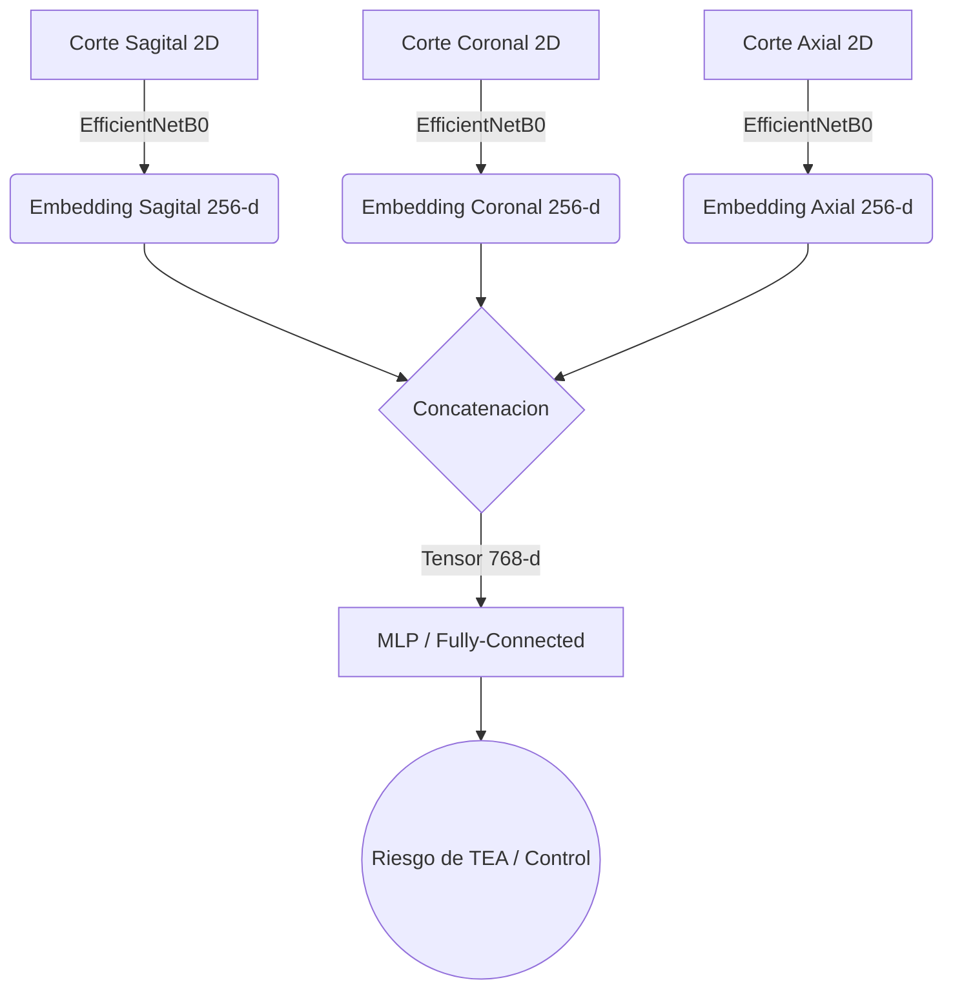

# Prediccion de Riesgo de Autismo con Fusion Temprana de Embeddings

[](https://www.python.org/)
[](https://pytorch.org/)
[](https://streamlit.io/)
[](LICENSE)

Aplicacion y pipeline experimental para estimar riesgo de trastorno del espectro autista (TEA) a partir de resonancias magneticas cerebrales (MRI) usando **fusion temprana de embeddings multivista**.

## Demo en vivo

Prueba la aplicacion desplegada en Streamlit:

- https://app-prediccion-autismo-fusion-embeddings.streamlit.app/

## Resumen de la solucion

El sistema trabaja con tres vistas ortogonales por sujeto:

- Sagital
- Coronal
- Axial

Cada vista se procesa con un backbone CNN para obtener embeddings de 256 dimensiones. Luego, los tres vectores se concatenan en un vector de 768 dimensiones y se clasifican con un MLP para estimar riesgo binario (TEA vs Control).

## Arquitectura



## Estructura del repositorio

```text
app_prediccion_autismo_fusion_embeddings/
├── README.md
├── app/
│   ├── app.py
│   ├── inference.py
│   ├── requirements.txt
│   └── assets/
├── data/
├── models/
│   └── baseline/
├── notebooks/
│   ├── EDA.ipynb
│   ├── PREPROCESAMIENTO.ipynb
│   ├── ENTRENAMIENTO_MODELOS_POR_CORTE.ipynb
│   └── ENTRENAMIENTO_MODELO_MULTIMODAL.ipynb
└── results/
```

## Instalacion y ejecucion local

1. Clonar el repositorio:

```bash
git clone https://github.com/ErnestoSCL/app_prediccion_autismo_fusion_embeddings.git
cd app_prediccion_autismo_fusion_embeddings
```

2. Crear entorno virtual e instalar dependencias de la app:

```bash
python -m venv .venv
# Windows
.venv\Scripts\activate
# Linux/Mac
# source .venv/bin/activate

pip install -r app/requirements.txt
```

3. Ejecutar Streamlit:

```bash
streamlit run app/app.py
```

La aplicacion se abre por defecto en `http://localhost:8501`.

## Resultados de referencia

Evaluacion reportada en conjunto held-out:

- AUROC: `0.6738`
- F1-score ponderado: `0.64`

Nota: el sistema esta orientado a tamizaje y apoyo investigativo. No sustituye protocolos clinicos de diagnostico (por ejemplo ADOS-2 o ADI-R).

## Datos y preprocesamiento

El pipeline asume estructura por sujeto (ejemplo: `subject_id/axial.png`, `subject_id/sagittal.png`, `subject_id/coronal.png`).

Dataset de referencia:

- https://huggingface.co/datasets/Bhagya11/ASD_3D_Images_Single

El notebook `notebooks/PREPROCESAMIENTO.ipynb` implementa division estratificada y transformaciones para entrenamiento.

## Licencia

Este proyecto se distribuye bajo licencia MIT.